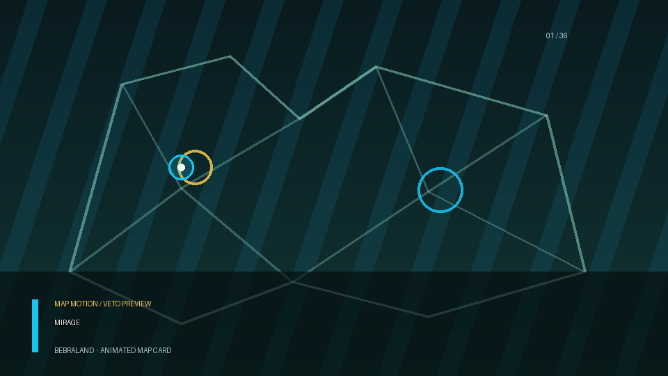

<div align="center">
  
  
  # MatchZy Auto Tournament
  
  ⚡ **Automated CS2 tournament management — one click from bracket creation to final scores**
  
  <p>Complete tournament automation for Counter-Strike 2 using the enhanced MatchZy plugin. Zero manual server configuration.</p>

## ✨ What's Enhanced in the BebraLand fork

The original platform already automates brackets, vetoes, and server loading. The BebraLand fork adds the admin ecosystem around the match: MAT becomes the single source of truth for tournament state and assets, while MatchZy and JTs Hud consume the same data automatically.

### Operator control

- 🎛️ **Operator Control Room** — gives admins explicit warmup, veto, start, pause, map, and series controls in one place, so they do not have to fight the server or manually repair a half-finished transition.
- 📋 **Execution queue** — lets an operator park, resume, and sequence matches when a tournament has more matches than immediately available servers.
- 🔁 **Live server reallocation** — moves a live match through safe handoff checkpoints, preserving the match context instead of restarting the workflow from zero.

### Broadcast ecosystem

This is the part that makes the fork different: the admin configures the tournament once in MAT, and the rest of the ecosystem follows the same state.

- 🧠 **MAT as the single source of truth** — teams, players, logos, avatars, maps, vetoes, sides, match state, and series results are managed in one admin system instead of being copied into a separate HUD workflow.
- ⚡ **Automatic JTs Hud integration** — the correct active match, teams, players, assets, map, veto, and series state flow into JTs Hud without the producer manually re-selecting or reconfiguring the overlay.
- 🧩 **One synchronized ecosystem** — MatchZy provides server telemetry, MAT owns the authoritative tournament and asset state, and JTs Hud/public pages render it. Operators stop maintaining several competing versions of the same match.
- 📊 **Persistent player statistics** — stores map snapshots and aggregates them into series stats, scoreboards, ratings, leaderboards, and player pages.
- 📡 **Broadcast-ready match output** — the same data drives veto broadcasts, live scoreboards, map-end screens, player pages, and HUD projections, so a last-minute admin change reaches every view consistently.

### Reliability & development

- 🧪 **Simulation tournaments** — run isolated bracket, veto, warmup, and HUD flows with generated teams and players before putting real teams on servers.
- 🗺️ **Custom map catalog and pools** — persist map previews, organizer pools, and veto metadata instead of relying only on a fixed built-in list.
- 🛡️ **Production safety** — rejects manual matches on busy servers, hides stale/completed matches from live views, handles reconnects, hardens demo downloads, and releases failed allocations cleanly.

This is the practical difference from upstream: the fork treats the tournament as one live system shared by operators, servers, statistics, and broadcast output.



[](LICENSE)
[](docker/docker-compose.yml)
[](https://www.typescriptlang.org/)

**📚 <a href="https://docs.sivert.io/docs/mat" target="_blank">Documentation</a>** • <a href="https://discord.gg/n7gHYau7aW" target="_blank">💬 Discord</a>

</div>

---

## 🎯 Who is this for?

- **Tournament Organizers** — Run professional CS2 tournaments with automated brackets, veto, ratings, and live stats
- **Casual Players** — Quick setup to play competitive matches with friends (5v5, 2v2, or custom)
- **Developers** — Open source platform for building CS2 tournament features

---

## ⚡ Quick Start (5 minutes)

### 1. Install Platform

```bash
# Clone and start
git clone https://github.com/BebraLand/matchzy-auto-tournament.git
cd matchzy-auto-tournament
cp example.env .env
docker compose up -d

# Open http://localhost:3069
```

### 2. Add CS2 Servers

**Option A: Automated (Recommended)**
- Use [CS2 Server Manager (CSM)](https://docs.sivert.io/docs/csm) to spin up servers with one command

**Option B: Manual**
- Install [CounterStrikeSharp](https://docs.cssharp.dev/) on your CS2 server
- Install [MatchZy Enhanced](https://github.com/BebraLand/MatchZy-Enhanced/releases)
- Add server in the platform: Settings → Servers

### 3. Create Tournament

Dashboard → New Tournament → Select format → Add teams → Start!

**That's it!** Matches auto-load on servers, veto happens in the browser, and brackets update live.

---

## ✨ What You Get

🏆 **Tournament Formats** — Single/Double Elimination, Swiss, Round Robin, Shuffle  
🗺️ **Map Veto** — FaceIT-style ban/pick for BO1/BO3/BO5  
📈 **Player Ratings** — OpenSkill-backed ELO system with leaderboards  
⚡ **Real-Time** — WebSocket updates for scores, connections, status  
🎮 **Auto-Everything** — Server allocation, match loading, bracket progression  
🎬 **Demo Recording** — Automatic upload and download  
👥 **Public Pages** — No-login team pages with server connect info

See screenshots in the docs: https://docs.sivert.io/docs/mat/user/screenshots

---

## 📖 Documentation (docs.sivert.io)

**For Tournament Admins (Operators):**
- [Admin Dashboard](https://docs.sivert.io/docs/mat/user/admin-dashboard)
- [Server Setup](https://docs.sivert.io/docs/mat/user/server-setup)
- [Creating Tournaments](https://docs.sivert.io/docs/mat/user/tournaments)

**For Developers:**
- [Contributing Guide](.github/CONTRIBUTING.md)
- [Architecture](https://docs.sivert.io/docs/mat/developer/architecture)
- [Testing](https://docs.sivert.io/docs/mat/developer/testing)

---

## 🔧 Requirements

- Docker & Docker Compose
- CS2 servers with [MatchZy Enhanced](https://github.com/BebraLand/MatchZy-Enhanced/releases)
- RCON access to servers

---

## 🔄 Updating (Docker)

If you run MAT via Docker Compose, the basic update flow is:

```bash
# (recommended) backup your database first
mkdir -p backups
docker compose exec -T postgres pg_dump -U "${DB_USER:-postgres}" "${DB_NAME:-matchzy_tournament}" > "backups/mat-$(date +%F-%H%M%S).sql"

# pull latest image + recreate containers
docker compose pull
docker compose up -d

# watch logs for startup/migrations
docker compose logs -f matchzy-tournament
```

More details: https://docs.sivert.io/docs/mat/user/updating

For local dev builds (build from source): `yarn docker:local:restart`.

---

## 🤝 Contributing

Contributions welcome! Bug fixes, features, docs improvements, translations, or ideas.

**Ways to contribute:**
- 🐛 [Report bugs or request features](.github/ISSUE_TEMPLATE/)
- 💻 [Submit code improvements](.github/CONTRIBUTING.md)
- 🌍 [Translate to your language](TRANSLATING.md)
- 📚 [Improve documentation](https://docs.sivert.io/docs/mat)

**[Read Full Contributing Guide](.github/CONTRIBUTING.md)**

---

## 📜 License

MIT License - see [LICENSE](LICENSE)

**Credits:** [cs2-server-manager](https://github.com/sivert-io/cs2-server-manager) • [brackets-manager.js](https://github.com/Drarig29/brackets-manager.js) • [brackets-viewer.js](https://github.com/Drarig29/brackets-viewer.js)

---

<div align="center">
  <strong>Made with ❤️ for the CS2 community</strong>
</div>
